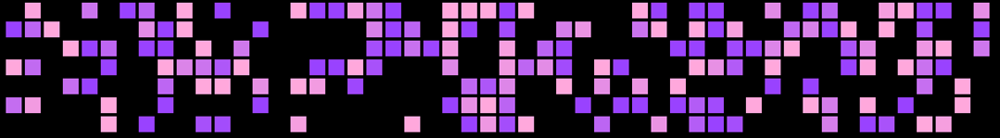

# Git y GitHub 101
¡Repo para crear tus primeras pull request, contenido y espacio para subir las evidencias del taller!

## Contenido

### ¡Gánate un peluche de Mona The Octocat🥳!

Si quieres participar en el sorteo de un *_peluche de Mona 🏆_*, acá te dejamos todas las instrucciones a seguir:

#### ¿Qué debo hacer para participar?

1. Completa la ruta de entrenamiento para el examen de certificación [GitHub Foundations 📎](https://learn.microsoft.com/en-us/training/paths/github-foundations/).
2. Crea un Pull Request con tu contribución al repositorio (puedes ver más detalles en: (link a HOW TO CONTRIBUTE).
3. Crea un Issue en este repositorio y sigue las instrucciones de la plantilla para subir tus evidencias.

> ![WARNING]
> La fecha límite para completar todos los pasos y subir tus evidencias es el 10 de octubre a las 23:59 (Horario CDMX). Todos los pasos se deben completar y enviar de la manera indicada para registrar tu participación en el sorteo.

Al completar todos los pasos, una persona del staff te confirmará tu participación al hacer merge a tu Pull Request 👏🏾.

##### ¿A poco no te quieres ganar esa chulada y aprender 🥰💖👇🏾?

> [!IMPORTANT]
> Esta dinámica solo es válida para estudiantes inscritos actualmente en la División de Ingenierías Campus Irapuato Salamanca, Universidad de Guanajuato.